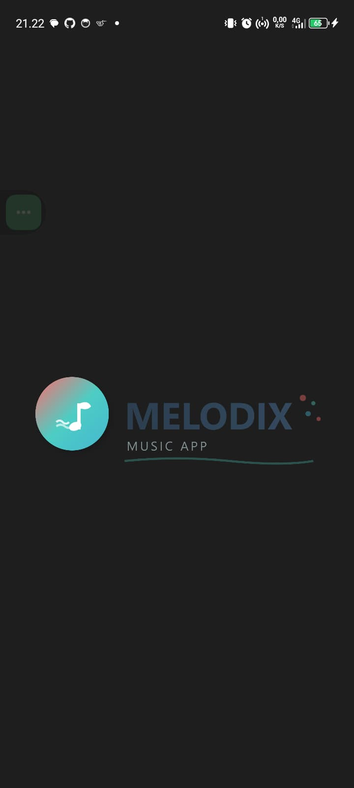
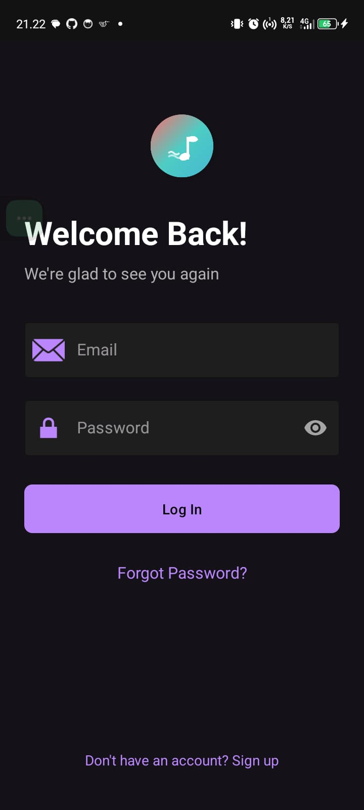
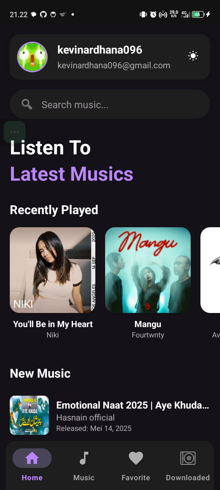
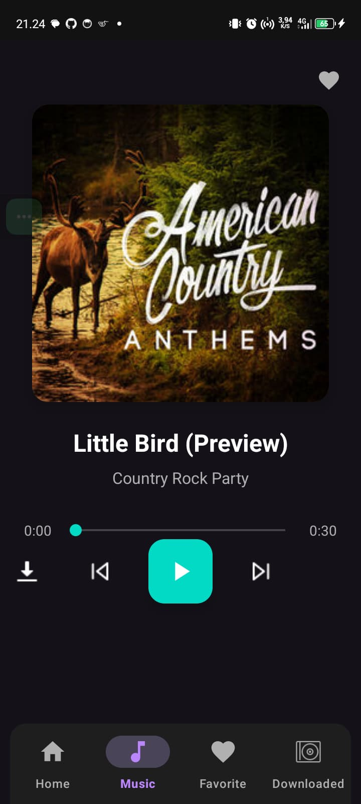
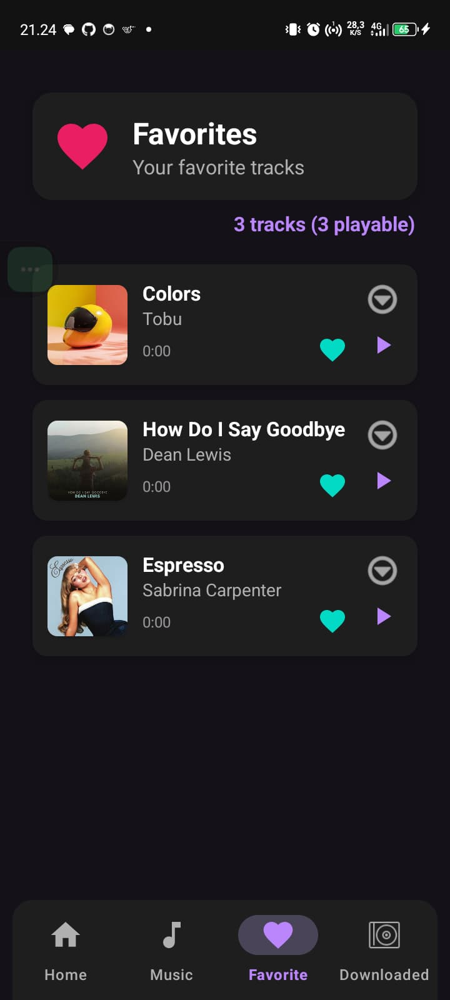
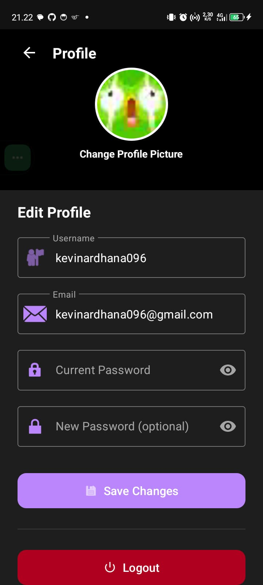

# Melodix - Aplikasi Pemutar Musik Android 🎵

## 1. Ringkasan Project

Melodix adalah aplikasi pemutar musik Android modern yang mengintegrasikan API Deezer untuk streaming musik. Aplikasi ini dikembangkan menggunakan Java dan menyediakan pengalaman mendengarkan musik yang komprehensif dengan fitur autentikasi, pencarian musik, favorit, dan download offline.

## 2. Tujuan Aplikasi

- Menyediakan platform streaming musik yang mudah digunakan
- Mengintegrasikan layanan musik populer (Deezer API)
- Memberikan pengalaman pengguna yang seamless dengan autentikasi Firebase
- Memungkinkan pengguna menyimpan musik favorit dan mengunduh untuk offline
- Menyediakan interface yang responsif dengan dukungan tema terang dan gelap

## 3. Teknologi yang Digunakan

### Backend & API:
- **Java** - Bahasa pemrograman utama (100%)
- **Firebase Authentication** - Sistem autentikasi pengguna
- **Firebase Firestore** - Database cloud untuk menyimpan data pengguna
- **Deezer API** - API streaming musik
- **SQLite** - Database lokal untuk musik yang diunduh

### Libraries & Framework:
- **Retrofit** - HTTP client untuk API calls
- **Gson** - JSON serialization/deserialization
- **Glide** - Image loading dan caching
- **OkHttp** - HTTP client
- **Material Design Components** - UI components
- **RecyclerView** - List management
- **MediaPlayer** - Audio playback

### Development Tools:
- **Android Studio** - IDE
- **Gradle** - Build system

## 4. Struktur Proyek

```
app/src/main/java/com/example/melodix/
├── activity/           # Activities
│   ├── MainActivity.java
│   ├── SplashActivity.java
│   ├── LoginActivity.java
│   ├── SignUpActivity.java
│   ├── ForgotPasswordActivity.java
│   ├── SetNewPasswordActivity.java
│   └── ProfileActivity.java
├── fragment/           # Fragments
│   ├── HomeFragment.java
│   ├── FavoriteFragment.java
│   └── DownloadFragment.java
├── adapter/            # RecyclerView Adapters
│   ├── NewMusicAdapter.java
│   ├── FavoriteAdapter.java
│   ├── SearchResultAdapter.java
│   └── RecentlyPlayedAdapter.java
├── model/              # Data Models
│   ├── Track.java
│   ├── Artist.java
│   ├── Album.java
│   └── SearchResponse.java
├── api/                # API Integration
│   ├── DeezerApiClient.java
│   ├── DeezerApiService.java
│   └── DeezerRepository.java
├── listener/           # Utilities & Managers
│   ├── MusicPlayer.java
│   ├── MusicDownloader.java
│   ├── ThemeManager.java
│   └── UserPreferencesManager.java
└── database/           # Local Database
    ├── DownloadedMusicDbHelper.java
    └── DownloadedMusicContract.java
```

## 5. Fitur-Fitur Aplikasi

### 🔐 Autentikasi & Profil
- Login/Register dengan Firebase Authentication
- Reset password via email
- Manajemen profil pengguna
- Logout dengan konfirmasi

### 🎵 Pemutar Musik
- Streaming musik melalui Deezer API
- Kontrol playback (play, pause, skip, previous)
- Progress bar dengan seek functionality
- Background audio playback
- Auto-play next track

### 🔍 Pencarian & Penemuan
- Pencarian real-time musik, artis, dan album
- Filter hasil pencarian berdasarkan kategori
- Discover musik baru dan trending
- Recently played tracks

### ❤️ Favorit & Koleksi
- Tambah/hapus musik ke/dari favorit
- Sinkronisasi favorit dengan cloud (Firebase)
- Kelola daftar musik favorit
- Quick access ke musik yang sering diputar

### 📱 Download & Offline
- Download musik untuk offline listening
- Manajemen file download
- Local storage dengan SQLite database
- Progress tracking saat download

### 🎨 Antarmuka & Tema
- Material Design interface
- Dark mode dan light mode
- Responsive design untuk berbagai ukuran layar
- Smooth animations dan transitions

### 🔧 Fitur Tambahan
- Splash screen dengan auto-login
- Error handling yang komprehensif
- Network state monitoring
- User preferences management

## 6. Tampilan Aplikasi

### Splash Screen
<div align="center">
  
</div>

### Login & Registration
<div align="center">
 
</div>

### Home Screen
<div align="center">
 
</div>

### Music Player
<div align="center">
 
</div>

### Favorites
<div align="center">
 
</div>

### Profile & Settings
<div align="center">
 
</div>

## 7. Instalasi & Menjalankan Proyek

### Prasyarat
- Android Studio Arctic Fox atau lebih baru
- JDK 11 atau lebih baru
- Android SDK API Level 21+ (Android 5.0+)
- Akun Firebase dan Deezer Developer

### Langkah Instalasi

1. **Clone Repository**
   ```bash
   git clone https://github.com/kevinardhana096/Melodix.git
   cd Melodix1
   ```

2. **Setup Firebase**
   - Buat project baru di [Firebase Console](https://console.firebase.google.com/)
   - Aktifkan Authentication dan Firestore
   - Download file `google-services.json`
   - Letakkan file tersebut di folder `app/`

3. **Setup Deezer API**
   - Daftar di [Deezer Developers](https://developers.deezer.com/)
   - Dapatkan Application ID
   - Update `AndroidManifest.xml`:
     ```xml
     <meta-data
         android:name="deezer.applicationId"
         android:value="YOUR_DEEZER_APPLICATION_ID" />
     ```

4. **Konfigurasi Facebook SDK** (Opsional)
   - Buat app di [Facebook Developers](https://developers.facebook.com/)
   - Tambahkan App ID ke `strings.xml`:
     ```xml
     <string name="facebook_app_id">YOUR_FACEBOOK_APP_ID</string>
     <string name="facebook_client_token">YOUR_FACEBOOK_CLIENT_TOKEN</string>
     ```

5. **Build Project**
   - Buka project di Android Studio
   - Sync Gradle files
   - Build dan jalankan aplikasi

### Menjalankan Aplikasi

1. **Development Mode**
   ```bash
   ./gradlew assembleDebug
   adb install app/build/outputs/apk/debug/app-debug.apk
   ```

2. **Release Mode**
   ```bash
   ./gradlew assembleRelease
   ```

### Troubleshooting

**Masalah Umum:**
- Pastikan internet connection untuk API calls
- Verifikasi konfigurasi Firebase dan Deezer API
- Check permissions di AndroidManifest.xml
- Pastikan minimum SDK version sesuai

**Log Debugging:**
```bash
adb logcat | grep "Melodix"
```

---

## Kontribusi

Untuk berkontribusi pada project ini:
1. Fork repository
2. Buat branch baru untuk fitur
3. Commit perubahan
4. Push ke branch
5. Buat Pull Request

## Lisensi

Project ini menggunakan lisensi MIT. Lihat file `LICENSE` untuk detail lengkap.

## Kontak

Dikembangkan oleh: Kevin Ardhana
GitHub: https://github.com/kevinardhana096/Melodix

---

*Melodix - Your Music, Your Way* 🎵
